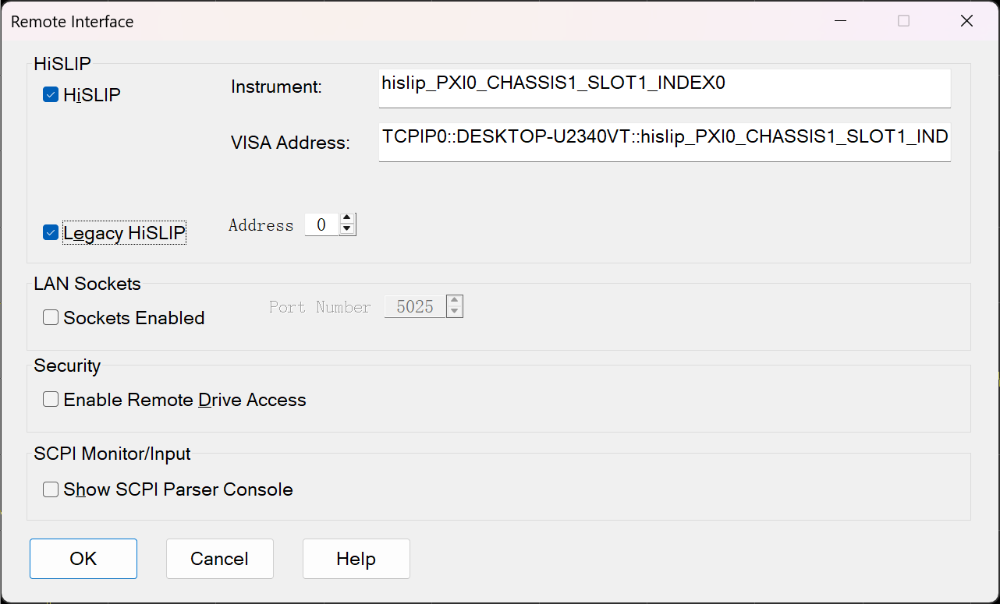
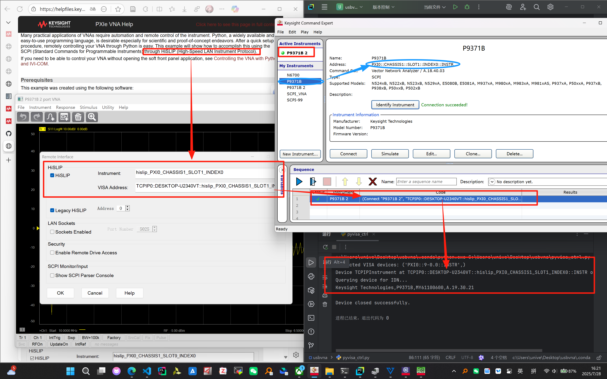

# USB-VNA (P9731B) 控制程序

[English](README.md) | 简体中文

 


## 项目简介

**请勿将测试代码上传至Master分支！**

本项目是用于控制 Keysight USB 矢量网络分析仪(VNA)的 Python 脚本，通过 PyVISA 库实现对设备的连接、控制和数据采集功能。适用于 P937X 系列 USB-VNA 设备，主要用于探地雷达(GPR)数据采集。软件还集成了RTK高精度定位系统，实现基于地理位置的数据采集，专为探地雷达应用设计。

References: 

- [KeySight Controlling the VNA Using Python](https://helpfiles.keysight.com/csg/pxivna/Programming/GPIB_Example_Programs/Controlling_the_VNA_Using_Python.htm)
- [PyVISA](https://pyvisa.readthedocs.io/en/latest/introduction/getting.html)

## 作者信息

贡献者：Linn  
邮箱：[universe_yuan@icloud.com](https://pyvisa.readthedocs.io/en/latest/introduction/getting.html)  
版权所有 (c) 2025 by Linn, All Rights Reserved.

## Git工作流程

为了方便课题组的入门接手和合作贡献，以下是基本的Git工作流程：

1. **克隆仓库**：首先从远程仓库克隆代码到本地
   ```bash
   git clone <仓库URL>
   ```

2. **创建分支**：在本地创建新分支进行开发
   ```bash
   git checkout -b <分支名>
   ```

3. **本地开发**：在本地分支上进行代码修改和测试

4. **提交更改**：将本地更改提交到本地仓库
   ```bash
   git add .
   git commit -m "提交说明"
   ```

5. **推送代码**：将本地分支推送到远程仓库（origin）
   ```bash
   git push origin <分支名>
   ```

6. **发起Pull Request**：在GitHub上发起Pull Request（PR），让别人审查并合并到目标分支（通常是上游仓库upstream的main/master分支）

7. **代码审查**：等待其他贡献者审查代码，根据反馈进行修改

8. **合并PR**：审查通过后，PR会被合并到目标分支

## 环境配置要求

### 系统要求
- 操作系统：Windows 7 或更高版本（推荐 Windows 10/11）、Linux 或 macOS
- Python 版本：Python 3.10（项目使用工程目录下的 Conda 环境）
- USB-VNA 设备：Keysight P973X 系列
- 设备驱动：Keysight Network Analyzers Python Instrument Drivers (版本 V2.0.2)

### 软件依赖
项目使用工程目录下的 Conda 环境，其中已包含运行所需的所有依赖包（未提交，请自行通过requirements.txt安装）：
- Python 3.10
- PyVISA
- PyQt6
- PyQt6-Fluent-Widgets
- ~~Keysight Network Analyzers Python Instrument Drivers (V2.0.2)~~ 弃用
- PySerial (用于RTK GPS模块通信)

【闲置】驱动程序已包含在项目中的压缩包 [keysight_ktna_V2.0.2_python3.10_64-bit_binary_package.zip](archive/keysight_ktna_V2.0.2_python3.10_64-bit_binary_package.zip) 内，并已在 Conda 环境中安装完毕。

### 可选依赖（用于数据可视化等）
```bash
pip install numpy
pip install matplotlib
pip install scipy
```

## 项目结构

```
src/
├── lib/                        # VNA控制模块
│   ├── __init__.py
│   ├── logger_config.py        # 日志配置模块
│   ├── vna_controller.py       # VNA控制器类
│   ├── fluent_window.py        # GUI界面实现
│   ├── rtk_module.py           # RTK定位模块
│   └── rtk_module_bak.py       # RTK定位模块备份
├── config/                     # 配置文件
│   └── config.json             # 配置文件
├── main_gui.py                 # GUI主程序入口
├── main_nogui.py               # 命令行主程序入口
├── HWT905_ttl.py               # HWT905陀螺仪接口(TTL通信)
├── 参考_rtk.py                  # RTK模块参考代码
├── GPR_Processsing_Script/     # GPR数据处理脚本
│   ├── b_scan_visualization.py # B扫描可视化脚本
│   └── [DEPRECATED]...         # 已废弃脚本
└── logs/                       # 日志文件目录
```

## 使用说明

### 基本使用方法
在项目 Conda 环境中运行GUI主程序：
```bash
python src/main_gui.py
```

或者运行命令行版本：
```bash
python src/main_nogui.py
```

### GUI界面功能说明

GUI界面基于PyQt6-Fluent-Widgets开发，提供直观易用的操作界面，主要功能包括：

1. **设备连接管理**
   - 设备自动发现与手动输入
   - 设备连接与断开
   - 获取设备ID信息
   - 查看和切换设备目录

2. **RTK定位模块**
   - 实时GPS位置显示（纬度、经度、海拔）
   - 卫星数和信号质量指示
   - 定位类型显示（RTK固定解/浮点解、单点定位等）
   - 可配置存储频率（1Hz-20Hz）
   - 数据导出为CSV格式

3. **数据采集配置**
   - 数据类型选择（CSV、SDP、SNP）
   - 数据范围设置（Trace、Displayed、Channel、Auto）
   - 数据格式选择（Displayed、RI、MA、DB）
   - 测量编号设置（-1到100）
   - 文件前缀设置
   - 采集间隔设置（0.01s-10s）

4. **三种采集模式**

   **点测模式**
   - 单次采集：每次点击采集指定数量的数据，每点击一次为一组
   - 连续点测：持续采集点测数据直到手动停止
   - 适用于需要按需采集的场景

   **定次采集模式**
   - 采集指定次数的数据文件
   - 适用于需要固定数量数据的实验

   **连续采集模式**
   - 持续采集数据直到手动停止
   - 实时显示采集进度
   - 适用于长时间连续监测场景

### VNAController 类说明
该类提供了控制 USB VNA 设备的基本方法：

1. `__init__()` - 初始化 VISA 资源管理器
2. `list_devices()` - 列出所有连接的 VISA 设备
3. `open_device(resource_name)` - 打开指定的 VISA 设备
4. `close_device()` - 关闭当前打开的设备
5. `query(command)` - 向设备发送查询命令并返回响应
6. `write(command)` - 向设备发送命令（无返回值）
7. `read()` - 从设备读取响应
8. `check_instrument_info()` - 检查仪器信息（*IDN?）
9. `catalog(path)` - 获取指定路径的目录内容
10. `cdir(path)` - 切换到指定目录
11. `data_dump(filename, data_type, scope, data_format, selector)` - 数据转储到文件

### RTK模块集成

RTK定位模块提供了实时GPS数据集成功能：

1. `__init__()` - 使用指定端口和波特率初始化RTK模块
2. `connect()` - 建立与RTK GPS模块的连接
3. `disconnect()` - 断开与RTK GPS模块的连接
4. `start()` - 开始读取RTK数据
5. `stop()` - 停止读取RTK数据
6. `set_storage_frequency()` - 设置数据存储频率
7. `set_data_file()` - 指定RTK数据的输出文件
8. `_parse_nmea_data()` - 解析NMEA协议数据（GGA、RMC、GSA）

### 日志记录
程序使用 logging 模块记录操作日志，日志文件保存在 `src/logs/` 目录下：
- vna_controller.log - VNA 控制器模块日志
- vna_gui.log - GUI界面日志
- vna_main.log - 命令行主程序日志
- vna_window.log - 窗口模块日志

日志级别包括 DEBUG、INFO、WARNING、ERROR 和 CRITICAL。

## 注意事项

1. 确保 USB VNA 设备已正确连接并安装了驱动程序
2. 运行程序前检查设备是否被其他程序占用
3. 根据实际设备修改设备资源名称
4. 如果遇到连接问题，尝试使用 NI-MAX 或 Keysight Connection Expert 工具检测设备
5. 避免电磁干扰，保持设备温度稳定，确保设备散热良好
6. 定期校准设备以确保测量精度
7. 设备需要在VNA前面板开启HiSLIP以及Drive Access以连接访问，如下图所示：


8. 对于RTK GPS功能，请确保RTK模块通过串口正确连接（通常为COM11）

## 故障排除

### 找不到设备
- 检查 USB 连接是否正常
- 确认设备驱动是否正确安装
- 使用 `list_devices()` 方法查看是否能检测到设备

### 通信超时
- 增加设备超时设置
- 检查设备是否处于忙碌状态
- 确认 SCPI 命令格式是否正确

### GUI界面问题
- 确保已安装 PyQt6 和 PyQt6-Fluent-Widgets
- 检查屏幕分辨率和缩放设置
- 如出现界面显示异常，尝试重置界面设置

### RTK GPS问题
- 验证串口连接和权限
- 检查波特率设置（通常为115200）
- 确保RTK模块已通电并接收到卫星信号
- 检查GUI中是否选择了正确的COM端口

## 开发指南

### 新团队成员入门指南
1. 仔细阅读 [DEVELOPMENT_GUIDE.md](src/DEVELOPMENT_GUIDE.md) 文档，了解项目架构和开发实践
2. 熟悉项目结构和核心模块
3. 按照需求部分设置您的开发环境
4. 在做更改之前先测试基本功能
5. 遵循项目中使用的代码风格和文档标准

### 需要了解的关键组件
- [vna_controller.py](file:///C:/Users/unive/Desktop/usbvna_v202511/src/lib/vna_controller.py): 核心设备通信和SCPI命令处理
- [fluent_window.py](file:///C:/Users/unive/Desktop/usbvna_v202511/src/lib/fluent_window.py): GUI实现，包含多线程数据采集
- [rtk_module.py](file:///C:/Users/unive/Desktop/usbvna_v202511/src/lib/rtk_module.py): GPS/RTK定位模块，包含NMEA协议解析
- [logger_config.py](file:///C:/Users/unive/Desktop/usbvna_v202511/src/lib/logger_config.py): 集中化日志配置

有关详细的开发和维护说明，请参阅 [DEVELOPMENT_GUIDE.md](src/DEVELOPMENT_GUIDE.md) 文档。
